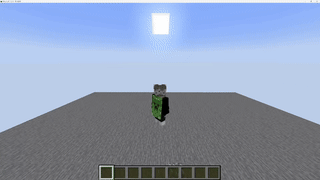

<div align="center">


**A typed scripting language that compiles to Minecraft datapacks.**

Write clean game logic. RedScript handles the scoreboard spaghetti.

[](https://github.com/bkmashiro/redscript/actions/workflows/ci.yml)
[](https://github.com/bkmashiro/redscript)
[](https://www.npmjs.com/package/redscript-mc)
[](https://www.npmjs.com/package/redscript-mc)
[](https://marketplace.visualstudio.com/items?itemName=bkmashiro.redscript-vscode)
[](https://redscript-ide.pages.dev)
[](./LICENSE)

[中文版](./README.zh.md) · [Quick Start](#quick-start) · [Docs](https://redscript-docs.pages.dev) · [Contributing](./CONTRIBUTING.md)

### 🚀 [Try it online — no install needed!](https://redscript-ide.pages.dev)



*↑ Particles spawning at player position every tick — 100% vanilla, no mods! Just 30 lines of RedScript with full control flow: `if`, `foreach`, `@tick`, f-strings, and more.*

</div>

---

### What is RedScript?

RedScript is a typed scripting language that compiles to vanilla Minecraft datapacks. Write clean code with variables, functions, loops, and events — RedScript handles the scoreboard commands and `.mcfunction` files for you.

**The demo above?** Just 30 lines:

```rs
let counter: int = 0;
let running: bool = false;

@tick fn demo_tick() {
    if (!running) { return; }
    counter = counter + 1;
    
    foreach (p in @a) at @s {
        particle("minecraft:end_rod", ~0, ~1, ~0, 0.5, 0.5, 0.5, 0.1, 5);
    }
    
    if (counter % 20 == 0) {
        say(f"Running for {counter} ticks");
    }
}

@keep fn start() {
    running = true;
    counter = 0;
    say(f"Demo started!");
}

@keep fn stop() {
    running = false;
    say(f"Demo stopped at {counter} ticks.");
}
```

**What you get:**
- ✅ `let` / `const` variables (no more `scoreboard players set`)
- ✅ `if` / `else` / `for` / `foreach` control flow
- ✅ `@tick` / `@load` / `@on(Event)` decorators
- ✅ `foreach (p in @a) at @s` — iterate entities with execute context
- ✅ f-strings like `f"Score: {points}"` for dynamic output
- ✅ One file → ready-to-use datapack

---

### What's New in v1.2

- `impl` blocks and methods for object-style APIs on structs
- `is` type narrowing for safer entity checks
- Static events with `@on(Event)`
- Runtime f-strings for `say`, `title`, `actionbar`, and related output
- Timer OOP API with `Timer::new(...)` and instance methods
- `setTimeout(...)` and `setInterval(...)` scheduling helpers
- Dead code elimination in the optimizer
- 313 Minecraft tag constants in the standard library

---

### Quick Start

#### Option 1: Online IDE (No Install)

**[→ redscript-ide.pages.dev](https://redscript-ide.pages.dev)** — Write code, see output instantly.

#### Option 2: VSCode Extension

1. Install [RedScript for VSCode](https://marketplace.visualstudio.com/items?itemName=bkmashiro.redscript-vscode)
2. Get syntax highlighting, auto-complete, hover docs, and more

#### Option 3: CLI

```mcrs
struct Timer { _id: int; duration: int; }

impl Timer {
    fn new(duration: int): Timer {
        return Timer { _id: 0, duration: duration };
    }
    fn done(self): bool { return true; }
}

@on(PlayerJoin)
fn welcome(player: Player) {
    say(f"Welcome {player}!");
}

@tick fn game_loop() {
    let timer = Timer::new(100);
    setTimeout(200, () => { say("Delayed!"); });
}
```

```bash
npm install -g redscript-mc
redscript compile game.mcrs -o ./my-datapack
```

#### Deploy

Drop the output folder into your world's `datapacks/` directory and run `/reload`. Done.

---

### The Language

#### Variables & Types

```rs
let x: int = 42;
let name: string = "Steve";
let spawn: BlockPos = (0, 64, 0);
let nearby: BlockPos = (~5, ~0, ~5);   // relative coords
const MAX: int = 100;                  // compile-time constant
```

#### MC Names (Objectives, Tags, Teams)

Use `#name` for Minecraft identifiers — no quotes needed:

```rs
// Objectives, fake players, tags, teams — write without quotes
let hp: int = scoreboard_get(@s, #health);
scoreboard_set(#game, #timer, 300);     // fake player #game, objective timer
tag_add(@s, #hasKey);
team_join(#red, @s);
gamerule(#keepInventory, true);

// String literals still work (backward compatible)
scoreboard_get(@s, "health")            // same output as #health
```

#### Functions & Defaults

```rs
fn greet(player: selector, msg: string = "Welcome!") {
    tell(player, msg);
}

greet(@s);              // uses default message
greet(@a, "Hello!");    // override
```

#### Decorators

```rs
@tick                  // every tick
fn heartbeat() { ... }

@tick(rate=20)         // every second
fn every_second() { ... }

@on_advancement("story/mine_diamond")
fn on_diamond() {
    give(@s, "minecraft:diamond", 5);
}

@on_death
fn on_death() {
    scoreboard_add(@s, #deaths, 1);
}
```

#### Control Flow

```rs
if (hp <= 0) {
    respawn();
} else if (hp < 5) {
    warn_player();
}

for (let i: int = 0; i < 10; i = i + 1) {
    summon("minecraft:zombie", (i, 64, 0));
}

foreach (player in @a) {
    heal(player, 2);
}
```

#### Structs & Enums

```rs
enum Phase { Lobby, Playing, Ended }

struct Player {
    score: int,
    alive: bool,
}

match (phase) {
    Phase::Lobby   => { announce("Waiting..."); }
    Phase::Playing => { every_second(); }
    Phase::Ended   => { show_scoreboard(); }
}
```

#### Lambdas

```rs
fn apply(f: (int) -> int, x: int) -> int {
    return f(x);
}

let double = (x: int) -> int { return x * 2; };
apply(double, 5);  // 10
```

#### Arrays

```rs
let scores: int[] = [];
push(scores, 42);

foreach (s in scores) {
    announce("Score: ${s}");
}
```

---

### CLI Reference

```
redscript compile <file>       Compile to datapack (default) or structure
  -o, --output <dir>           Output directory         [default: ./out]
  --target datapack|structure  Output format            [default: datapack]
  --namespace <ns>             Datapack namespace       [default: filename]
  --no-optimize                Skip optimizer passes
  --stats                      Print optimizer statistics

redscript repl                 Interactive REPL
redscript validate <file>      Validate MC commands
```

---

### Standard Library

```rs
import "stdlib/math.mcrs"       // abs, min, max, clamp
import "stdlib/player.mcrs"     // is_alive, in_range, get_health
import "stdlib/timer.mcrs"      // start_timer, tick_timer, has_elapsed
import "stdlib/cooldown.mcrs"   // set_cooldown, check_cooldown
import "stdlib/mobs.mcrs"       // ZOMBIE, SKELETON, CREEPER, ... (60+ constants)
```

---

### Further Reading

| | |
|---|---|
| 📖 [Language Reference](docs/LANGUAGE_REFERENCE.md) | Full syntax & type system |
| 🔧 [Builtins](https://redscript-docs.pages.dev/Builtins) | All 34+ MC builtin functions |
| ⚡ [Optimizer](https://redscript-docs.pages.dev/Optimizer) | How the optimizer works |
| 🧱 [Structure Target](docs/STRUCTURE_TARGET.md) | Compile to NBT command block structures |
| 🧪 [Integration Testing](https://redscript-docs.pages.dev/Integration-Testing) | Test against a real Paper server |
| 🏗 [Implementation Guide](docs/IMPLEMENTATION_GUIDE.md) | Compiler internals |

---

### Changelog Highlights

#### v1.2.0

- Added `impl` blocks, methods, and static constructors
- Added `is` type narrowing for entity-safe control flow
- Added `@on(Event)` static events and callback scheduling builtins
- Added runtime f-strings for output functions
- Expanded stdlib with Timer OOP APIs and 313 MC tag constants
- Improved optimization with dead code elimination

See [CHANGELOG.md](./CHANGELOG.md) for the full release notes.

---

<div align="center">

MIT License · Copyright © 2026 [bkmashiro](https://github.com/bkmashiro)

*Write less. Build more. Ship faster.*

</div>
