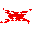

<div align="center">



# RedScript

**编译到 Minecraft 数据包的类型化语言**

写干净的代码，生成原版数据包。无需 Mod。

[](https://www.npmjs.com/package/redscript-mc)
[](https://github.com/bkmashiro/redscript/actions/workflows/ci.yml)
[](https://github.com/bkmashiro/redscript)
[](https://marketplace.visualstudio.com/items?itemName=bkmashiro.redscript-vscode)

[English](./README.md) · [文档](https://redscript-docs.pages.dev) · [在线编辑器](https://redscript-ide.pages.dev)

</div>

---

## 为什么用 RedScript？

Minecraft 数据包很强大，但写起来很痛苦：

```mcfunction
# 原版：检查玩家分数 >= 100 并给奖励
execute as @a[scores={points=100..}] run scoreboard players add @s rewards 1
execute as @a[scores={points=100..}] run scoreboard players set @s points 0
execute as @a[scores={points=100..}] run give @s minecraft:diamond 1
execute as @a[scores={points=100..}] run tellraw @s {"text":"领取成功!"}
```

```rs
// RedScript：同样的逻辑，更易读
@tick fn check_rewards() {
    foreach (p in @a) {
        if (scoreboard_get(p, #points) >= 100) {
            scoreboard_add(p, #rewards, 1);
            scoreboard_set(p, #points, 0);
            give(p, "minecraft:diamond", 1);
            tell(p, "领取成功!");
        }
    }
}
```

## 快速开始

### 在线体验（无需安装）

**[→ redscript-ide.pages.dev](https://redscript-ide.pages.dev)** — 写代码，下载数据包。

### 安装 CLI

```bash
npm install -g redscript-mc
```

### Hello World

```rs
// hello.mcrs
@load fn init() {
    say("Hello from RedScript!");
}

@tick fn game_loop() {
    foreach (p in @a[tag=playing]) {
        effect(p, "minecraft:speed", 1, 0, true);
    }
}
```

```bash
redscript build hello.mcrs -o ./my-datapack
```

把 `my-datapack/` 放到世界的 `datapacks/` 文件夹，运行 `/reload`。完成。

---

## 功能特性

### 语言

| 特性 | 示例 |
|------|------|
| 变量 | `let x: int = 42;` |
| 函数 | `fn damage(target: selector, amount: int) { ... }` |
| 控制流 | `if`, `else`, `for`, `while`, `foreach`, `match` |
| 结构体 | `struct Player { score: int, alive: bool }` |
| 枚举 | `enum State { Lobby, Playing, Ended }` |
| Option 类型 | `let item: Option<int> = Some(5);` |
| Result 类型 | `let r: Result<int, string> = Ok(42);` |
| 格式字符串 | `say(f"分数: {points}");` |
| 模块 | `import math; math::sin(45);` |

### Minecraft 集成

```rs
// 游戏事件装饰器
@tick fn every_tick() { }
@tick(rate=20) fn every_second() { }
@load fn on_datapack_load() { }
@on(PlayerJoin) fn welcome(p: Player) { }

// 实体选择器自然使用
foreach (zombie in @e[type=zombie, distance=..10]) {
    kill(zombie);
}

// execute 子命令
foreach (p in @a) at @s positioned ~ ~2 ~ {
    particle("minecraft:flame", ~0, ~0, ~0, 0.1, 0.1, 0.1, 0.01, 10);
}

// 协程分散计算（跨 tick 执行）
@coroutine(batch=100)
fn process_all() {
    for (let i = 0; i < 10000; i = i + 1) {
        // 不会卡顿 — 每 tick 只执行 100 次迭代
    }
}
```

### 工具链

- **15 个优化 pass** — 死代码消除、常量折叠、内联等
- **LSP** — 悬停文档、跳转定义、自动补全、诊断
- **VSCode 扩展** — 完整语法高亮和代码片段
- **50 个标准库模块** — 数学、向量、寻路、粒子等

---

## CLI 命令

```bash
redscript build <file>     # 带优化编译
redscript compile <file>   # 不带优化编译
redscript check <file>     # 仅类型检查
redscript fmt <file>       # 格式化代码
redscript lint <file>      # 静态分析
redscript test <file>      # 运行 @test 函数
redscript watch <dir>      # 监听模式，热重载
redscript docs [module]    # 打开标准库文档
```

---

## 标准库

50 个模块，覆盖数学、数据结构、游戏系统和 MC 特定功能：

```rs
import math;        // sin, cos, sqrt, pow, abs
import vec;         // 2D/3D 向量, dot, cross, normalize
import random;      // LCG/PCG 随机数生成器
import pathfind;    // A* 寻路
import particles;   // 粒子辅助
import inventory;   // 物品栏操作
import scheduler;   // 延迟执行
import ecs;         // 实体组件系统
// ... 还有 42 个
```

完整列表：[标准库文档](https://redscript-docs.pages.dev/en/stdlib/)

---

## 示例

| 文件 | 描述 |
|------|------|
| [`loops-demo.mcrs`](./examples/loops-demo.mcrs) | 所有循环结构 |
| [`showcase.mcrs`](./examples/showcase.mcrs) | 完整功能展示 |

更多示例在 [`examples/`](./examples/) 目录。

---

## 文档

- **[入门指南](https://redscript-docs.pages.dev/en/guide/)** — 安装和第一个项目
- **[语言参考](https://redscript-docs.pages.dev/en/reference/)** — 完整语法指南
- **[标准库参考](https://redscript-docs.pages.dev/en/stdlib/)** — 50 个模块文档
- **[CLI 参考](https://redscript-docs.pages.dev/en/cli/)** — 命令行选项

---

## 链接

- [在线编辑器](https://redscript-ide.pages.dev)
- [VSCode 扩展](https://marketplace.visualstudio.com/items?itemName=bkmashiro.redscript-vscode)
- [npm 包](https://www.npmjs.com/package/redscript-mc)
- [更新日志](./CHANGELOG.md)
- [贡献指南](./CONTRIBUTING.md)

---

<div align="center">

MIT License · [bkmashiro](https://github.com/bkmashiro)

</div>
